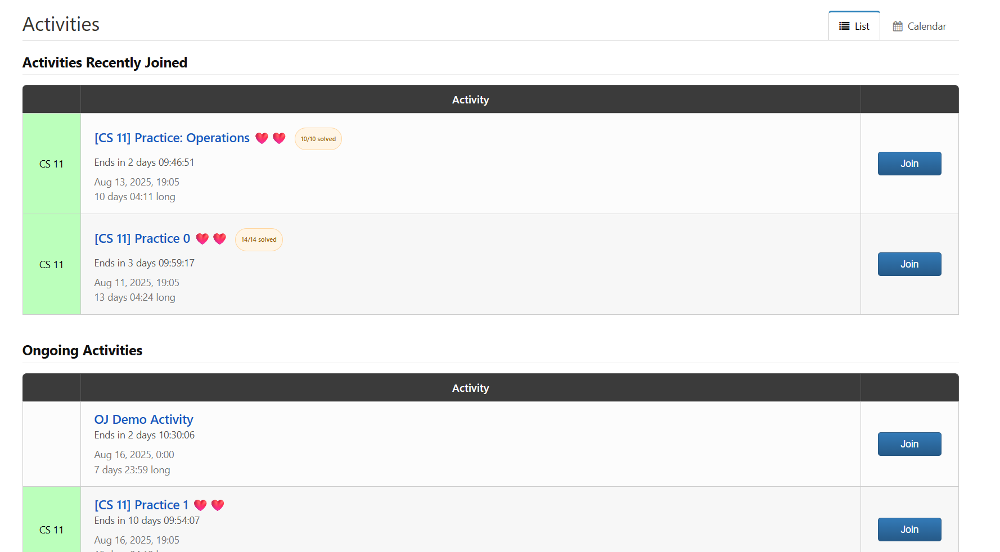
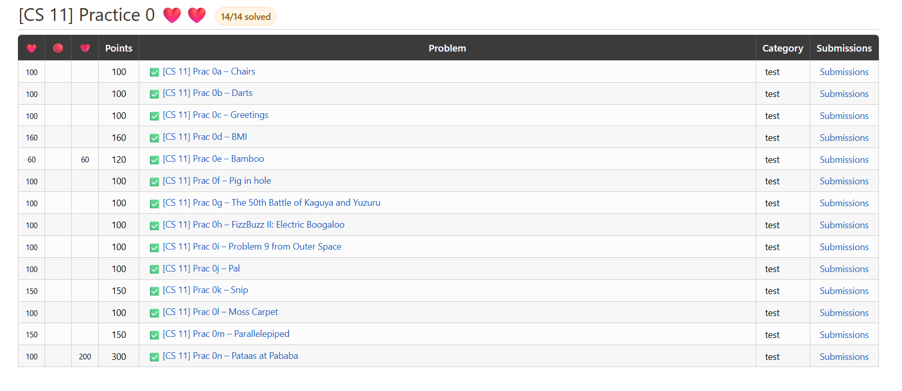

# Citrus Status (Firefox Extension)

Adds emoji status indicators and activity-level solved fractions to the UPD Online Judge at https://oj.dcs.upd.edu.ph/.

## Features
- 😊 Emoji before problems based on verdict
  - ✅ Accepted (AC)
  - ❌ Wrong Answer (WA)
  - ⏰ Time Limit Exceeded (TLE)
  - 💾 Memory Limit Exceeded (MLE)
  - ⚠️ Invalid Return (IR)
  - 👀 Compile Error (CE)
- 🟠 Activity-level progress fraction (e.g., 9/10)
- 💾 Local storage of statuses (no server)

## Sample Screenshots

## How to Install
1. Download the whole repository as a `.zip` file and extract (or clone the repo).
2. Go to the extensions page at `about:debugging`.
3. Click on **Load Temporary Add-on**.
4. Select the `manifest.json`.

This extension must be loaded for every time you load Firefox.

## Acknowledgements
This is simply a Firefox port of the [Citrus-Status extension](https://github.com/Imaginatorix/Citrus-Status) by Imaginatronix. Thank you very much for this extension!

## License
GNU GENERAL PUBLIC LICENSE Version 3
